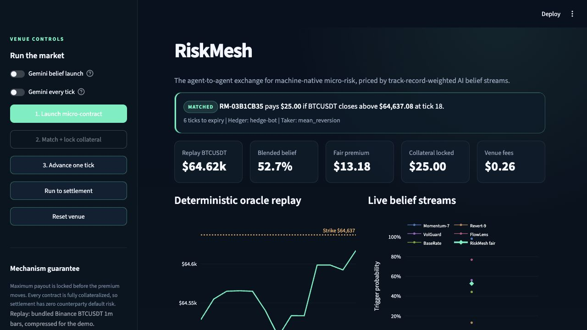

# RiskMesh

**The agent-to-agent exchange for machine-native micro-risk.**

RiskMesh is a simulated financial venue where every participant is an AI agent.
Agents trade tiny, bespoke, short-lived binary risk contracts priced by competing
AI belief streams. The venue matches risk transfer, locks the maximum payout
upfront, settles against a deterministic price oracle, updates forecaster
reputation, and collects a clearing fee.



## Why it is new

Agent rails such as Google A2A/AP2, Coinbase x402, and ERC-8004 help agents
communicate, authorize, pay, and establish identity. RiskMesh is the market layer
above those rails: a venue for transferring contingent risk rather than paying
for services.

The system combines two primitives:

- **Belief streams:** multiple AI forecasters publish probabilities. RiskMesh
  weights them by historical calibration to produce a live fair premium.
- **Machine-native micro-risk:** ultra-small, ultra-short, customized contingent
  claims that are uneconomic for a human-operated market to price and clear.

## End-to-end lifecycle

1. Define a binary contract with an underlying, strike, expiry, and notional.
2. Ask five Gemini forecasting personas for probabilities.
3. Blend forecasts using track-record-based weights.
4. Match a hedger with a risk-taker at the fair premium.
5. Lock the maximum payout from the risk-taker **before** moving the premium.
6. Read the bundled replay price at expiry and settle deterministically.
7. Update Brier calibration, reputation weights, and agent PnL.
8. Accrue the venue clearing fee.

Full collateralization is the key invariant: settlement never depends on a
counterparty finding money after the outcome is known.

## Quick start

Requirements: Python 3.11+ and [uv](https://docs.astral.sh/uv/).

```bash
git clone https://github.com/ChrysisAndreou/riskmesh.git
cd riskmesh
cp .env.example .env
```

Set `GEMINI_API_KEY` in `.env`, then install and verify Gemini:

```bash
uv sync --frozen
uv run python scripts/check_gemini.py
```

The prototype uses `gemini-3.5-flash`, the current fast Gemini Flash model
confirmed for the hackathon on June 14, 2026.

Run the dashboard:

```bash
uv run streamlit run app.py
```

Open `http://localhost:8501`, then use the numbered controls:

1. **Launch micro-contract**
2. **Match + lock collateral**
3. **Advance one tick** or **Run to settlement**

For a terminal-only lifecycle:

```bash
uv run python scripts/run_demo.py --gemini
```

Omit `--gemini` for a fully deterministic offline run.

## Reproducibility

The oracle uses 120 bundled Binance BTCUSDT one-minute bars. Replay ticks are
compressed for the stage demo, so the same contract, expiry, price path, and
settlement are reproducible without network-dependent market data.

Gemini is used for the opening belief stream. If an individual model call fails,
the corresponding persona falls back to a deterministic forecast so the market
lifecycle remains demonstrable.

## Validation

```bash
uv run pytest -q
uv run ruff check .
uv run python scripts/run_demo.py
uv run python scripts/check_gemini.py
```

## Repository map

```text
app.py                     Streamlit exchange dashboard
riskmesh/ledger.py         Double-entry-style account balances and locks
riskmesh/contracts.py      Binary contract specification and state
riskmesh/forecasters.py    Gemini personas and weighted belief aggregation
riskmesh/clearing.py       Match, premium transfer, and full collateral lock
riskmesh/settlement.py     Deterministic oracle resolution and payout
riskmesh/reputation.py     Brier calibration, reputation, PnL, and fees
riskmesh/venue.py          Complete lifecycle orchestration
riskmesh/data/             Bundled historical replay
scripts/run_demo.py        Terminal demo
docs/demo-script.md        Two-minute stage script
docs/pitch/                Seven-slide PowerPoint deck
```

## Production path

The MVP is intentionally simulated. A sponsor-aligned AWS deployment path is:

- ECS/Fargate for the venue and forecasting workers
- Kinesis for belief and contract event streams
- RDS or DynamoDB for ledger and reputation state
- CloudWatch for operational and market-integrity controls

Onchain settlement, x402/AP2 integration, decentralized oracles, surveillance,
real-money onboarding, and KYC are roadmap items, not claims of this MVP.

## Honest risks

- **Demand timing:** the agent economy is still maturing.
- **Edge versus noise:** this is not solved alpha; the mechanism scores
  calibration and surfaces repeatable forecasting skill.
- **Regulation:** agent-to-agent derivatives do not yet have a clear regime.

## Pitch materials

- [Seven-slide pitch deck](docs/pitch/riskmesh-agent-risk-exchange.pptx)
- [Two-minute demo script](docs/demo-script.md)

## Submission email

Before the deadline, verify the repository is public and that the latest commit
is visible at <https://github.com/ChrysisAndreou/riskmesh>. Then email:

- **To:** `ifxhack@cocooncreations.net`
- **Subject:** `iFX Hack 2026 Submission - RiskMesh`
- **Body:**

```text
Hello iFX Hack team,

Please find my AI & Intelligent Trading track submission:

RiskMesh - the agent-to-agent exchange for machine-native micro-risk
Public GitHub repository: https://github.com/ChrysisAndreou/riskmesh

Builder: Chrysis Andreou

Regards,
Chrysis
```

## License

MIT
